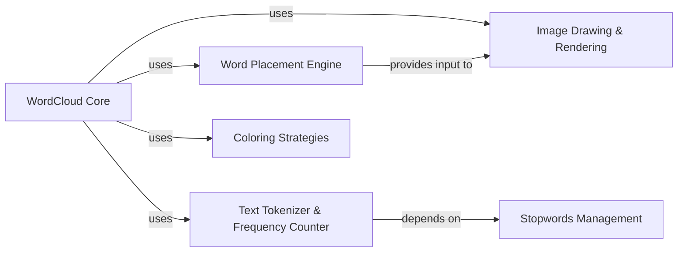

## Component Details

This project is a Python library for generating word clouds. It consists of several interconnected components responsible for text processing, word placement, image rendering, and coloring strategies. The `WordCloud Core` acts as the central orchestrator, coordinating the activities of other components to produce the final word cloud image. Text is tokenized and frequencies are counted, with common stopwords being managed separately. Words are then strategically placed on the canvas, and their colors are determined by various strategies before being drawn onto the image. This modular design allows for clear separation of concerns and facilitates customization and maintenance of the word cloud generation process.

### WordCloud Core

This is the primary class and the central orchestrator of the entire word cloud generation process. It encapsulates all the configuration parameters (e.g., dimensions, font, colors, mask), manages the workflow, and provides the main interface for users to create and output word clouds. It coordinates interactions between other components.

**Related Classes/Methods**:

- <a href="https://github.com/amueller/word_cloud/blob/master/wordcloud/wordcloud.py#L153-L1041" target="_blank" rel="noopener noreferrer">`wordcloud.wordcloud.WordCloud` (153:1041)</a>

- <a href="https://github.com/amueller/word_cloud/blob/master/wordcloud/wordcloud.py#L557-L603" target="_blank" rel="noopener noreferrer">`wordcloud.wordcloud.WordCloud.process_text` (557:603)</a>

- <a href="https://github.com/amueller/word_cloud/blob/master/wordcloud/wordcloud.py#L390-L555" target="_blank" rel="noopener noreferrer">`wordcloud.wordcloud.WordCloud.generate_from_frequencies` (390:555)</a>

- <a href="https://github.com/amueller/word_cloud/blob/master/wordcloud/wordcloud.py#L649-L670" target="_blank" rel="noopener noreferrer">`wordcloud.wordcloud.WordCloud.to_image` (649:670)</a>

- <a href="https://github.com/amueller/word_cloud/blob/master/wordcloud/wordcloud.py#L672-L712" target="_blank" rel="noopener noreferrer">`wordcloud.wordcloud.WordCloud.recolor` (672:712)</a>

### Text Tokenizer & Frequency Counter

This component is responsible for transforming raw input text into a structured format suitable for word cloud generation. It performs tasks such as tokenizing the text (splitting into words), filtering out common "stopwords," normalizing plurals, and calculating the frequency of individual words and significant two-word phrases (bigrams/collocations).

**Related Classes/Methods**:

- <a href="https://github.com/amueller/word_cloud/blob/master/wordcloud/tokenization.py#L0-L0" target="_blank" rel="noopener noreferrer">`wordcloud.tokenization` (0:0)</a>

- <a href="https://github.com/amueller/word_cloud/blob/master/wordcloud/tokenization.py#L38-L71" target="_blank" rel="noopener noreferrer">`wordcloud.tokenization.unigrams_and_bigrams` (38:71)</a>

- <a href="https://github.com/amueller/word_cloud/blob/master/wordcloud/tokenization.py#L74-L137" target="_blank" rel="noopener noreferrer">`wordcloud.tokenization.process_tokens` (74:137)</a>

### Word Placement Engine

This component efficiently determines the optimal, non-overlapping positions for each word on the word cloud canvas. It utilizes an "Integral Occupancy Map" data structure to quickly find available space, considering the word's size, orientation, and any specified mask.

**Related Classes/Methods**:

- <a href="https://github.com/amueller/word_cloud/blob/master/wordcloud/wordcloud.py#L0-L0" target="_blank" rel="noopener noreferrer">`wordcloud.query_integral_image` (0:0)</a>

- <a href="https://github.com/amueller/word_cloud/blob/master/wordcloud/wordcloud.py#L37-L66" target="_blank" rel="noopener noreferrer">`wordcloud.query_integral_image.IntegralOccupancyMap` (37:66)</a>

### Image Drawing & Rendering

This component handles the low-level graphical operations required to draw the words onto an image. It uses the Pillow (PIL) library to create the image canvas, load fonts, render text at specific positions and sizes, and apply rotations.

**Related Classes/Methods**:

- <a href="https://github.com/amueller/word_cloud/blob/master/wordcloud/wordcloud.py#L0-L0" target="_blank" rel="noopener noreferrer">`wordcloud.wordcloud.WordCloud._draw_words` (0:0)</a>

### Coloring Strategies

This component provides diverse methods for determining the color of each word in the word cloud. It includes functionality to derive colors directly from an input image, apply a predefined Matplotlib colormap, or assign a single, uniform color across all words. These strategies are implemented as callable functions or classes that the `WordCloud` core uses to assign colors to individual words.

**Related Classes/Methods**:

- <a href="https://github.com/amueller/word_cloud/blob/master/wordcloud/color_from_image.py#L4-L57" target="_blank" rel="noopener noreferrer">`wordcloud.color_from_image.ImageColorGenerator` (4:57)</a>

- <a href="https://github.com/amueller/word_cloud/blob/master/wordcloud/wordcloud.py#L90-L113" target="_blank" rel="noopener noreferrer">`wordcloud.wordcloud.colormap_color_func` (90:113)</a>

- <a href="https://github.com/amueller/word_cloud/blob/master/wordcloud/wordcloud.py#L116-L150" target="_blank" rel="noopener noreferrer">`wordcloud.wordcloud.get_single_color_func` (116:150)</a>

### Stopwords Management

This component provides a collection of common words (stopwords) that are typically filtered out during text processing. Excluding these words helps to emphasize more meaningful terms in the word cloud.

**Related Classes/Methods**:

- <a href="https://github.com/amueller/word_cloud/blob/master/wordcloud/wordcloud.py#L0-L0" target="_blank" rel="noopener noreferrer">`wordcloud.stopwords.STOPWORDS` (0:0)</a>

### [FAQ](https://github.com/CodeBoarding/GeneratedOnBoardings/tree/main?tab=readme-ov-file#faq)