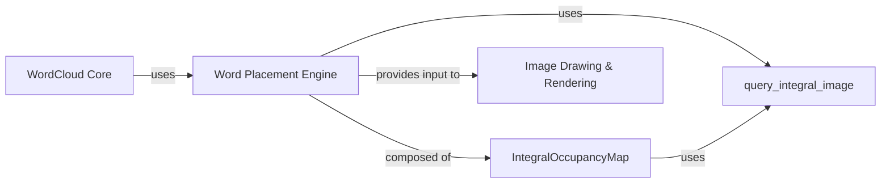

## Component Details

The Word Placement Engine is a critical component responsible for the efficient and non-overlapping arrangement of words on the word cloud canvas. Its primary purpose is to determine optimal positions for each word, ensuring visual clarity and maximizing the density of the word cloud. It achieves this through the use of an IntegralOccupancyMap data structure, which is highly optimized by leveraging a C extension (query_integral_image) for high-performance spatial queries and updates. The synergy between the IntegralOccupancyMap (providing the efficient data structure) and query_integral_image (providing the efficient algorithm) is what makes the Word Placement Engine robust and performant. Without it, generating a visually appealing and non-overlapping word cloud would be either impossible or extremely slow.

### Word Placement Engine

The Word Placement Engine is a critical component responsible for the efficient and non-overlapping arrangement of words on the word cloud canvas. Its primary purpose is to determine optimal positions for each word, ensuring visual clarity and maximizing the density of the word cloud. It achieves this through the use of an IntegralOccupancyMap data structure, which is highly optimized by leveraging a C extension (query_integral_image) for high-performance spatial queries and updates.

**Related Classes/Methods**:

- <a href="https://github.com/amueller/word_cloud/blob/master/wordcloud/wordcloud.py#L37-L66" target="_blank" rel="noopener noreferrer">`wordcloud.wordcloud.IntegralOccupancyMap` (37:66)</a>

- <a href="https://github.com/amueller/word_cloud/blob/master/wordcloud/wordcloud.py#L1-L1" target="_blank" rel="noopener noreferrer">`wordcloud.query_integral_image` (1:1)</a>

### IntegralOccupancyMap

This Python class acts as the manager for the canvas's occupancy state. It maintains an "integral image" representation of the word cloud canvas, which allows for rapid calculation of sums over rectangular regions. This integral image is initialized either from a provided mask (if a shape mask is used) or as an empty canvas.

**Related Classes/Methods**:

- <a href="https://github.com/amueller/word_cloud/blob/master/wordcloud/wordcloud.py#L38-L46" target="_blank" rel="noopener noreferrer">`wordcloud.wordcloud.IntegralOccupancyMap:__init__` (38:46)</a>

- <a href="https://github.com/amueller/word_cloud/blob/master/wordcloud/wordcloud.py#L48-L50" target="_blank" rel="noopener noreferrer">`wordcloud.wordcloud.IntegralOccupancyMap:sample_position` (48:50)</a>

- <a href="https://github.com/amueller/word_cloud/blob/master/wordcloud/wordcloud.py#L52-L66" target="_blank" rel="noopener noreferrer">`wordcloud.wordcloud.IntegralOccupancyMap:update` (52:66)</a>

### query_integral_image

This is a high-performance C extension (implemented in `query_integral_image.pyx`) that performs the actual search for a non-overlapping position within the `IntegralOccupancyMap`. It is designed for speed, as Python-level loops for such a task would be prohibitively slow for large word clouds.

**Related Classes/Methods**:

- <a href="https://github.com/amueller/word_cloud/blob/master/wordcloud/wordcloud.py#L1-L1" target="_blank" rel="noopener noreferrer">`wordcloud.query_integral_image` (1:1)</a>

### WordCloud Core

Core component responsible for orchestrating the word cloud generation process.

**Related Classes/Methods**: _None_

### Image Drawing & Rendering

Component responsible for drawing words onto the final image using calculated positions.

**Related Classes/Methods**: _None_

### [FAQ](https://github.com/CodeBoarding/GeneratedOnBoardings/tree/main?tab=readme-ov-file#faq)