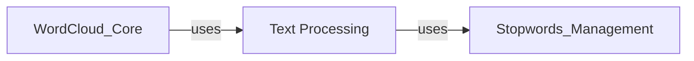

## Component Details

Analysis of the Text Processing component, its functionalities, and its interactions within the word cloud generation system for word cloud generation. This component is fundamental for preparing raw text by handling tokenization, stopword removal, plural normalization, and collocation identification, which are crucial for accurate frequency counts and meaningful visualization. It interacts with 'Stopwords Management' for filtering and is utilized by 'WordCloud Core' to process input text into word frequencies for visualization.

### Text Processing

This component is dedicated to transforming raw input text into a structured format suitable for word cloud generation. It handles essential tasks such as tokenization (breaking text into individual words), removing common stopwords, normalizing plurals, and identifying significant collocations (bigrams) based on statistical measures.

**Related Classes/Methods**:

- <a href="https://github.com/amueller/word_cloud/blob/master/wordcloud/tokenization.py#L38-L71" target="_blank" rel="noopener noreferrer">`wordcloud.tokenization.unigrams_and_bigrams` (38:71)</a>

- <a href="https://github.com/amueller/word_cloud/blob/master/wordcloud/tokenization.py#L74-L137" target="_blank" rel="noopener noreferrer">`wordcloud.tokenization.process_tokens` (74:137)</a>

### [FAQ](https://github.com/CodeBoarding/GeneratedOnBoardings/tree/main?tab=readme-ov-file#faq)