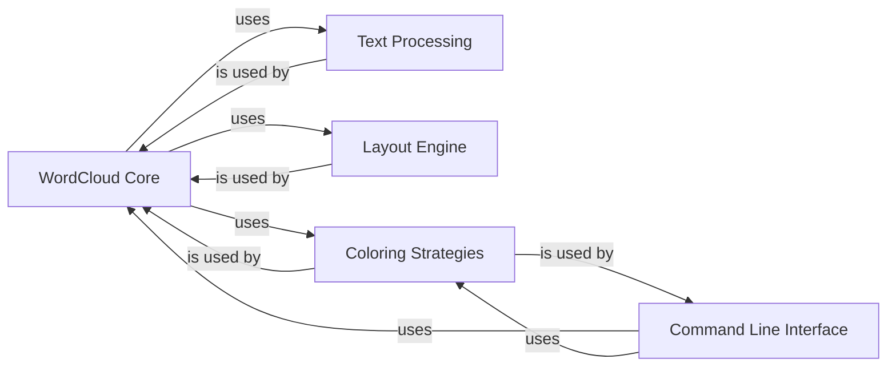

## Component Details

Based on the Control Flow Graph (CFG) analysis and the detailed Source Analysis, the `word_cloud` project's architecture can be distilled into five fundamental components. These components represent distinct functional areas, ensuring modularity and clear responsibilities within the system.

### WordCloud Core

This is the central orchestrator of the entire word cloud generation process. It manages the overall workflow, from accepting text input and configuration parameters to coordinating text processing, word placement, and final image rendering. It acts as the primary interface for generating a word cloud.

**Related Classes/Methods**:

- <a href="https://github.com/amueller/word_cloud/blob/master/wordcloud/wordcloud.py#L153-L1041" target="_blank" rel="noopener noreferrer">`wordcloud.wordcloud:WordCloud` (153:1041)</a>

### Text Processing

This component is dedicated to transforming raw input text into a structured format suitable for word cloud generation. It handles essential tasks such as tokenization (breaking text into individual words), removing common stopwords, normalizing plurals, and identifying significant collocations (bigrams) based on statistical measures.

**Related Classes/Methods**:

- <a href="https://github.com/amueller/word_cloud/blob/master/wordcloud/tokenization.py#L0-L0" target="_blank" rel="noopener noreferrer">`wordcloud.tokenization` (0:0)</a>

### Layout Engine

Crucial for the visual arrangement of words, this component efficiently places words on the canvas. It utilizes an IntegralOccupancyMap data structure, which leverages a C extension (query_integral_image) for high-performance operations, ensuring words are placed without overlapping and optimizing the density of the word cloud.

**Related Classes/Methods**:

- <a href="https://github.com/amueller/word_cloud/blob/master/wordcloud/wordcloud.py#L37-L66" target="_blank" rel="noopener noreferrer">`wordcloud.wordcloud:IntegralOccupancyMap` (37:66)</a>

- <a href="https://github.com/amueller/word_cloud/blob/master/wordcloud/wordcloud.py#L0-L0" target="_blank" rel="noopener noreferrer">`wordcloud.query_integral_image` (0:0)</a>

### Coloring Strategies

This component provides diverse methods for determining the color of each word in the word cloud. It includes functionality to derive colors directly from an input image, apply a predefined Matplotlib colormap, or assign a single, uniform color across all words.

**Related Classes/Methods**:

- <a href="https://github.com/amueller/word_cloud/blob/master/wordcloud/color_from_image.py#L0-L0" target="_blank" rel="noopener noreferrer">`wordcloud.color_from_image` (0:0)</a>

- <a href="https://github.com/amueller/word_cloud/blob/master/wordcloud/wordcloud.py#L90-L113" target="_blank" rel="noopener noreferrer">`wordcloud.wordcloud:colormap_color_func` (90:113)</a>

- <a href="https://github.com/amueller/word_cloud/blob/master/wordcloud/wordcloud.py#L116-L150" target="_blank" rel="noopener noreferrer">`wordcloud.wordcloud:get_single_color_func` (116:150)</a>

### Command Line Interface

This module provides a user-friendly command-line interface, allowing users to generate word clouds directly from the terminal without needing to write Python code. It parses command-line arguments and orchestrates the WordCloud Core object to produce the desired output.

**Related Classes/Methods**:

- <a href="https://github.com/amueller/word_cloud/blob/master/wordcloud/wordcloud_cli.py#L0-L0" target="_blank" rel="noopener noreferrer">`wordcloud.wordcloud_cli` (0:0)</a>

### [FAQ](https://github.com/CodeBoarding/GeneratedOnBoardings/tree/main?tab=readme-ov-file#faq)