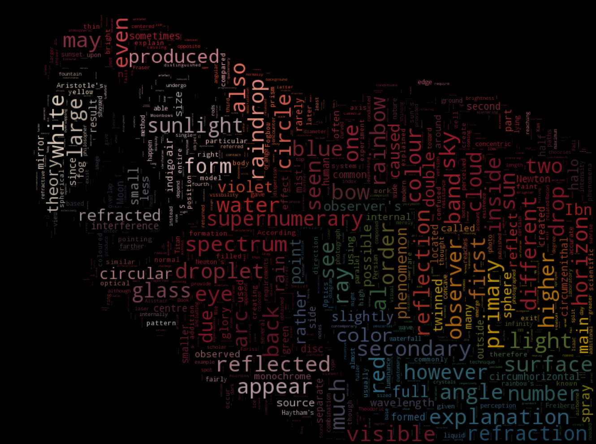

word_cloud
==========

A little word cloud generator in Python. Read more about it on the [blog
post][blog-post] or the [website][website].
The code is Python 2, but Python 3 compatible.

## Installation

Fast install:

    pip install wordcloud

If you are using conda, it might be even easier to use anaconda cloud:

    conda install -c https://conda.anaconda.org/amueller wordcloud

For a manual install get this package:
    
    wget https://github.com/amueller/word_cloud/archive/master.zip
    unzip master.zip
    rm master.zip
    cd word_cloud-master

Install the package:

    python setup.py install

#### Installation notes

worcloud depends on numpy>=1.5.1, pillow and matplotlib.
To install it via pip, you will also need a C compiler.

##### Windows

If you're having trouble with pip installation on windows, you can find a .whl file at:

http://www.lfd.uci.edu/~gohlke/pythonlibs/#wordcloud

##### Ubuntu

If the installation of the package fails, due to a missing ``pyconfig.h`` file, you need to install the python-dev package. 

For Python 2.*

	sudo apt-get install python-dev
	
For Python 3.*

	sudo apt-get install python3-dev
	
##### CentOS / RHEL

If the compilation via gcc of the package fails, due to a missing ``Python.h`` file, you need to install the python-devel package. 

For Python 2.*

	sudo yum install -y python-devel
	
For Python 3.*

	sudo yum install -y python34-devel

## Examples

Check out [examples/simple.py][simple] for a short intro. A sample output is:

Or run [examples/masked.py][masked] to see more options. A sample output is:

Getting fancy with some colors:

## Command-line usage

The `wordcloud_cli.py` tool can be used to generate word clouds directly from the command-line:

	$ wordcloud_cli.py --text mytext.txt --imagefile wordcloud.png

If you're dealing with PDF files, then `pdftotext`, included by default with many Linux distribution, comes in handy:

	$ pdftotext mydocument.pdf - | wordcloud_cli.py --imagefile wordcloud.png

In the previous example, the `-` argument orders `pdftotext` to write the resulting text to stdout, which is then piped to the stdin of `wordcloud_cli.py`.

Use `wordcloud_cli.py --help` so see all available options.

## Used in

### Reddit Cloud

[Reddit Cloud][reddit-cloud] is a Reddit bot which generates word clouds for
comments in submissions and user histories. You can see it being operated on
[/u/WordCloudBot2][wc2] ([top posting][wc2top]).

### Chat Stats (Twitch.tv)

[Chat Stats][chat-stats] is a visualization program for Twitch streams,
which generates word clouds for comments made by Twitch users in the chat.
It also creates various charts and graphs pertaining to concurrent viewership
and chat rate over time.

### Twitter Word Cloud Bot

[Twitter Word Cloud Bot][twitter-word-cloud-bot] is a twitter bot which generates
word clouds for twitter users when it is mentioned with a particular hashtag.
[Here][twitter-wordnuvola] you can see it in action, while [here][imgur-wordnuvola]
you can see all the word clouds generated so far.

### Stack Overflow Users Tag Cloud

[Stackoverflow Tag Cloud](https://github.com/droyed/stackoverflow_tag_cloud) generates tag clouds of users on [Stack Overflow](http://stackoverflow.com/) or any [Stack Exchange site](https://stackexchange.com/sites). If you are contributing to Stack Overflow community, it's an easy way to share your expertise with others through an image. Here's Stack Overflow's highest reputation user [Jon Skeet's](http://stackoverflow.com/users/22656/jon-skeet) tag cloud -

### [other]

*Send a pull request to add yours here.*

## Issues

Using Pillow instead of PIL might might get you the [`TypeError: 'int' object is
not iterable` problem][intprob] also showcased on the blog.

[blog-post]: http://peekaboo-vision.blogspot.de/2012/11/a-wordcloud-in-python.html
[website]: http://amueller.github.io/word_cloud/
[simple]: examples/simple.py
[masked]: examples/masked.py
[reddit-cloud]: https://github.com/amueller/reddit-cloud
[wc2]: http://www.reddit.com/user/WordCloudBot2
[wc2top]: http://www.reddit.com/user/WordCloudBot2/?sort=top
[chat-stats]: https://github.com/popcorncolonel/Chat_stats
[twitter-word-cloud-bot]: https://github.com/defacto133/twitter-wordcloud-bot
[twitter-wordnuvola]: https://twitter.com/wordnuvola
[imgur-wordnuvola]: http://defacto133.imgur.com/all/
[intprob]: http://peekaboo-vision.blogspot.de/2012/11/a-wordcloud-in-python.html#bc_0_28B

## Licensing
The wordcloud library is MIT licenced, but contains DroidSansMono.ttf, a true type font by Google, that is apache licensed.
The font is by no means integral, and any other font can be used by setting the ``font_path`` variable when creating a ``WordCloud`` object.
