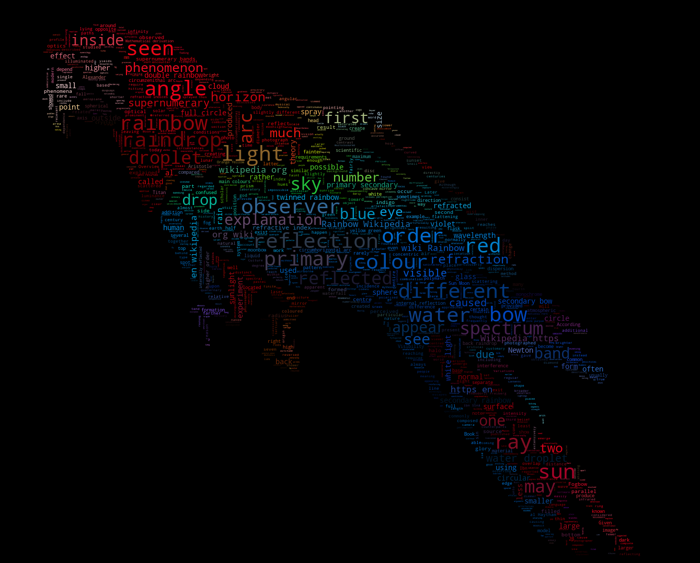

|      | Linux                                        | macOS                                        | Windows                                      |
|------|----------------------------------------------|----------------------------------------------|----------------------------------------------|
| PyPI | [![CircleCI][circleci_image]][circleci_link] | [![TravisCI][travisci_image]][travisci_link] | [![AppVeyor][appveyor_image]][appveyor_link] |

[circleci_link]: https://circleci.com/gh/amueller/word_cloud/tree/master
[circleci_image]: https://circleci.com/gh/amueller/word_cloud/tree/master.svg?style=svg

[travisci_link]: https://travis-ci.org/amueller/word_cloud
[travisci_image]: https://travis-ci.org/amueller/word_cloud.svg?branch=master

[appveyor_link]: https://ci.appveyor.com/project/amueller/word-cloud/branch/master
[appveyor_image]: https://img.shields.io/appveyor/ci/amueller/word-cloud/master.svg

word_cloud
==========

A little word cloud generator in Python. Read more about it on the [blog
post][blog-post] or the [website][website].

The code is tested against Python 2.7, 3.4, 3.5, 3.6 and 3.7.

## Installation

If you are using pip:

    pip install wordcloud

If you are using conda, you can install from the `conda-forge` channel:

    conda install -c conda-forge wordcloud

#### Installation notes

wordcloud depends on `numpy` and `pillow`.

To save the wordcloud into a file, `matplotlib` can also be installed. See [examples](#examples) below.

If there are no wheels available for your version of python, installing the
package requires having a C compiler set up. Before installing a compiler, report
an issue describing the version of python and operating system being used.

## Examples

Check out [examples/simple.py][simple] for a short intro. A sample output is:

Or run [examples/masked.py][masked] to see more options. A sample output is:

Getting fancy with some colors:

Generating wordclouds for Arabic:

## Command-line usage

The `wordcloud_cli` tool can be used to generate word clouds directly from the command-line:

	$ wordcloud_cli --text mytext.txt --imagefile wordcloud.png

If you're dealing with PDF files, then `pdftotext`, included by default with many Linux distribution, comes in handy:

	$ pdftotext mydocument.pdf - | wordcloud_cli --imagefile wordcloud.png

In the previous example, the `-` argument orders `pdftotext` to write the resulting text to stdout, which is then piped to the stdin of `wordcloud_cli.py`.

Use `wordcloud_cli --help` so see all available options.

[blog-post]: http://peekaboo-vision.blogspot.de/2012/11/a-wordcloud-in-python.html
[website]: http://amueller.github.io/word_cloud/
[simple]: examples/simple.py
[masked]: examples/masked.py
[reddit-cloud]: https://github.com/amueller/reddit-cloud
[wc2]: http://www.reddit.com/user/WordCloudBot2
[wc2top]: http://www.reddit.com/user/WordCloudBot2/?sort=top
[chat-stats]: https://github.com/popcorncolonel/Chat_stats
[twitter-word-cloud-bot]: https://github.com/defacto133/twitter-wordcloud-bot
[twitter-wordnuvola]: https://twitter.com/wordnuvola
[imgur-wordnuvola]: http://defacto133.imgur.com/all/
[intprob]: http://peekaboo-vision.blogspot.de/2012/11/a-wordcloud-in-python.html#bc_0_28B

## Licensing
The wordcloud library is MIT licenced, but contains DroidSansMono.ttf, a true type font by Google, that is apache licensed.
The font is by no means integral, and any other font can be used by setting the ``font_path`` variable when creating a ``WordCloud`` object.
