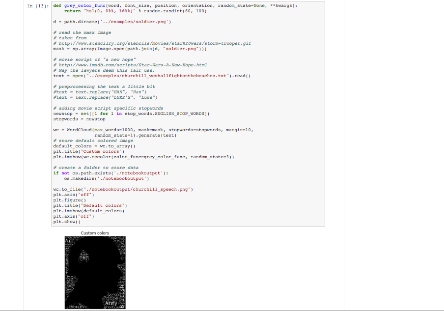

Creating wordclouds in Jupyter Notebooks
====================

Setup instructions
---------------------

These instructions walk you through setting up and installing all the necessary components to test and build wordclouds in a Jupyter notebook embedded in an Anaconda environment. I'm starting from the lowest common denominator (complete beginner), so feel free to skip around. 

Jupyter Notebook is a web application that allows you to create and share documents that contain live code, equations, visualizations and explanatory text in over 40 programming languages.  To learn more about Jupyter and try a python demonstration, see [this online browser demo of a python notebook](https://try.jupyter.org/).  Follow the steps below, and you will be creating wordclouds in a notebook!




### First Step: Downloading and Installing Git and Anaconda
The first step is to get all the necessary files and programs downloaded.  You will need to clone this repository using [Git](https://git-scm.com/downloads) and also have [Anaconda](https://www.continuum.io/why-anaconda) installed. So download the files at the links: 

1.  Git: https://git-scm.com/book/en/v2/Getting-Started-Installing-Git 

2.  Anaconda: http://docs.continuum.io/anaconda/install

*If you are working on Windows, I advise using Git Bash which came from your install of Git above.*  

Let's check to see if the installs worked properly.  Open up Git Bash or a terminal and type `git` in the terminal:

```
$ git

[Output:]

usage: git [--version] [--help] [-C <path>] [-c name=value]
           [--exec-path[=<path>]] [--html-path] [--man-path] [--info-path]
           [-p | --paginate | --no-pager] [--no-replace-objects] [--bare]
           [--git-dir=<path>] [--work-tree=<path>] [--namespace=<name>]
           <command> [<args>]

These are common Git commands used in various situations:

start a working area (see also: git help tutorial)
   clone      Clone a repository into a new directory
   init       Create an empty Git repository or reinitialize an existing one
...

```


We do the same to check Anaconda, by typing `conda` in the prompt:

```
$ conda

[Output:]

usage: conda [-h] [-V] [--debug] command ...

conda is a tool for managing and deploying applications, environments and packages.

Options:

positional arguments:
  command
    info         Display information about current conda install.
    help         Displays a list of available conda commands and their help
                 strings.
...
```
With these steps complete, we are more than halfway to being up and running!

### Second Step: Clone the wordcloud repository

I strongly advise cloning this repository because it makes running the examples easier. You can follow the simple reference system in the example notebook I set up. First, in your terminal or Git Bash terminal, navigate to a directory where you want to save this repository (for a primer or refresher on navigating the command line, complete [CodeAcademy's Command Line Course](https://www.codecademy.com/learn/learn-the-command-line)). Next enter:

```
$ git clone https://github.com/linwoodc3/word_cloud.git
```

This should clone the repository to your computer. The last thing you need to do is change to the base directory of the repository by returning to your ** Git Bash** or terminal or command prompt and entering:

```
$ cd word_cloud
```


###  Third Step: Recreate the environment to run the Notebook

First, a small introduction on why we need to recreate the environment I used to make these notebooks.  Anaconda makes it easy to manage virtual environments, or the place where the script and analytic operates (in this case, where we make the wordcloud).  Virtual environments are important to data analytics, data science, and development because you can create, export, list, remove, and update environments that have different versions of software, modules, and/or packages installed in them. These environments are independent of one another, and, most importantly, of your root system's requirements and modules.  Therefore, installing an updated or older version of a module in an Anaconda environment doesn't update the version in any other environment. Bottomline, environments keep you from breaking things.

For you, this is beneficial becuase I can "export" an environment file that allows you to recreate the exact Python environment I used to make the wordcloud notebook (see picture above).

Make sure you are in the base `word_cloud` repistory from the previous step.Return to your ** Git Bash** or terminal or command prompt and enter:

```
$ cd notebooks/requirements_notebook/

$ conda env create -f anaconda_wordcloud.yml
$ source activate wordcloud
$ conda install notebook ipykernel
$ ipython kernel install
```

To handle this in one swoop, just cut and paste the text below:<br>
> conda env create -f anaconda_wordcloud.yml <br>source activate wordcloud<br>conda install notebook ipykernel<br>ipython kernel install<br>

You may get some prompts (not errors) asking for permission to install.  Always hit `y` and `Enter`.  Wait for everything to finish.

### Final Step:  Launch environment and launch Jupyter notebook

Now, it's time to launch the notebook!  Return to your ** Git Bash** or terminal or command prompt and enter:

```
$ cd ..
```

This should get you to the `notebook` directory.  First we activate the wordcloud environment we just created by entering `source activate wordcloud` in the terminal.  Then we'll launch the notebook using a simple command `jupyter notebook wordcloudexample.ipynb`.  Here's how it would look:

```
$ source activate wordcloud

$ jupyter notebook wordcloudexample.ipynb
```

Your web browser should open up and you're ready to go.  Just hit the `play` button to watch the code run.  You can also copy the examples from the examples folder by changing a few parameters!  Have fun!

### Random notes to help test this out

You can get `mask` images from the net easily.  Just do a Google image search.  Here is an [example of a search for `soldier silouhettes`](https://www.google.com/search?q=soldier+silhouette&safe=active&espv=2&biw=1215&bih=634&source=lnms&tbm=isch&sa=X&ved=0ahUKEwiYlszfu_rKAhXDeT4KHev3BNgQ_AUIBigB#q=soldier+silhouette&safe=active&tbm=isch&tbs=isz:l).  

Here is a [good tutorial on using Google's image search](https://techboomers.com/t/google-image-search).

Finding text is even simpler!  Just find some text, copy or save it to a `.txt` file, and have fun!

Later, I'll add examples that iterate over cells of text in a spreadsheet to build a wordcloud.  This is useful for mining social web text (Facebook, Google+, Twitter).  


